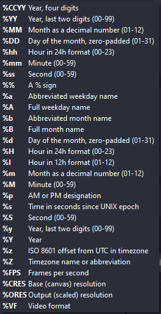

# RecordingSettings

| **Property** | **Type** | **Description** |
| --- | --- | --- |
| settings | object | **Optional**. See fields below. |
| settings.fileNameFormat | string | **Optional**. Format of the file name, including extension. The file name may contain replaceable tokens from the table below (the same tokens that are used in OBS UI). Default: “SE.Live (OBS settings or *%CCYY-%MM-%DD %hh-%mm-%ss).mkv”* |
| settings.splitAtMaximumMegabytes | number | **Optional**. Integer number. Default: 0 |
| settings.splitAtMaximumDurationSeconds | number | **Optional**. Integer number. Default: 0 |
| settings.overwriteExistingFiles | bool | **Optional**. Specifies whether existing files should be overwritten. Default: false |
| settings.allowSpacesInFileNames | bool | **Optional**. Specifies whether spaces are allowed in file names. Default: true |

Filename format replaceable tokens:

